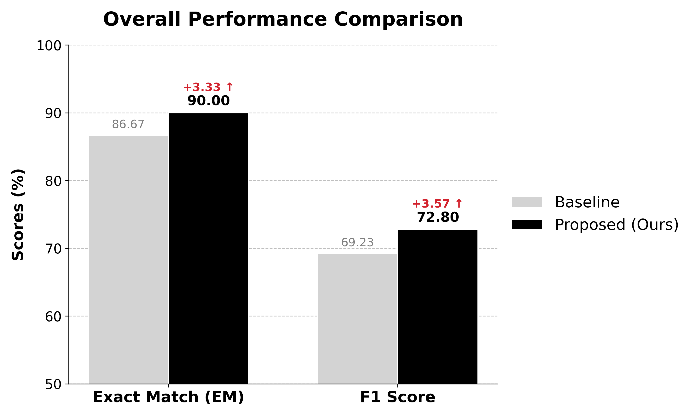
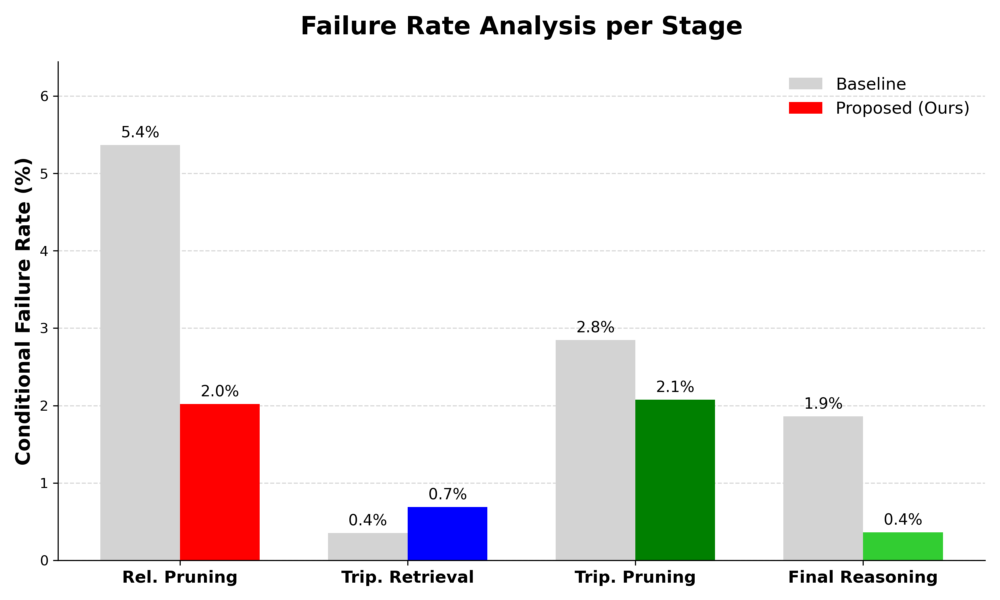

# Bridging the Gap in ProgRAG: A Robust Hybrid Strategy for KGQA

This repository contains the code for the graduation project: **"Bridging the Gap in ProgRAG: A Robust Hybrid Strategy for KGQA"**.
Our framework improves upon the [ProgRAG](https://github.com/hyemin-yang/ProgRAG) framework, introducing structural and prompting optimizations to enhance robustness in Knowledge Graph Question Answering.

> **Note:** The evaluation was conducted on a randomly sampled subset of the **WebQSP** benchmark (**$N=300$**) using the **Gemma-2-9b-it** backbone.

## 🚀 Key Features

We aim to address the limitations of iterative pruning in KGQA through the following improvements:

1.  **Robust Relation Pruning (Hybrid Union)**
    * **Hybrid Union:** Mitigates the "Single Point of Failure" by enforcing the union of LLM-selected relations and retriever-ranked candidates.
    * **Relevance Scoring:** Replaces rigid type-based filtering with explicit 0-10 scoring to granularly differentiate high-quality evidence.
2.  **Attention Fusion Layer (Triple Retrieval)**
    * Overcomes the rigidity of static weighting strategies.
    * Adaptively balances **semantic** and **structural** evidence based on the question context.
3.  **3-Shot Prompting Strategy (Reasoning)**
    * Enhances reasoning stability and reduces latency by replacing iterative uncertainty quantification with a single-pass few-shot strategy.

## 📊 Experimental Results (Subset, N=300)

Our method demonstrates improved performance on the sampled WebQSP dataset:

<p align="center">
  
  <br>
  <em>Figure: Comparative analysis of Exact Match (EM) and F1 scores.</em>
</p>

| Metric | ProgRAG (Baseline) | **Ours (Hybrid)** | Improvement |
| :--- | :---: | :---: | :---: |
| **Exact Match (EM)** | 86.67% | **90.00%** | **+3.33%p** |
| **F1 Score** | 69.23% | **72.80%** | **+3.57%p** |

* **Failure Rate Reduction:** The error rate in the **Relation Pruning** stage was reduced by **63%**, indicating that the hybrid approach effectively secures the reasoning path.

<p align="center">
  
  <br>
  <em>Figure: Failure rate analysis per stage.</em>
</p>

## 🛠️ Environment Setup
This project uses the same environment as the original ProgRAG.
```bash
# 1. Create and activate a new conda environment
conda create -n RobustKGQA python=3.8 -y
conda activate RobustKGQA

# 2. Install PyTorch with CUDA 11.8 support
conda install pytorch==2.2.1 torchvision==0.17.1 torchaudio==2.2.1 pytorch-cuda=11.8 -c pytorch -c nvidia

# 3. Install PyTorch Geometric and related packages
pip install torch-scatter==2.1.1 torch-sparse==0.6.17 torch-cluster==1.6.1 torch-spline-conv==1.2.1 -f [https://data.pyg.org/whl/torch-2.2.1+cu118.html](https://data.pyg.org/whl/torch-2.2.1+cu118.html)
pip install torch-geometric==2.3.0

# 4. Install additional dependencies
conda install ninja easydict pyyaml -c conda-forge

# 5. Install compatible Hugging Face packages
pip install transformers==4.46.3 tokenizers==0.20.0 huggingface_hub==0.36.0 safetensors==0.5.3

# 6. Install Sentence Transformers and Datasets
pip install "sentence-transformers[train]==3.0.1" datasets==2.14.7
```

## 📂 Data Preparation

To reproduce our results, please download the backbone datasets and checkpoints (MPNet, GNN).

1. **Download Resources:**
* [Google Drive Link](https://drive.google.com/drive/folders/1BVvQRNTaLdONEeFauZfxPYQXQSpCVuNm?usp=drive_link) (Provided by ProgRAG authors)
* Download the `data/` and `ckpt/` folders.

2. **Organize Directory:**
* Place the downloaded folders into the root directory.
* Ensure `fusion.pt` (provided in this repo) is located in `ckpt/`.
```text
Robust-KGQA/
├── ckpt/
│   ├── fusion.pt         <-- ✅ PROVIDED in this repo (Ours)
│   ├── mpnet/            <-- ⬇️ Downloaded from ProgRAG Drive
│   └── GNN/              <-- ⬇️ Downloaded from ProgRAG Drive
├── data/                 <-- ⬇️ Downloaded from ProgRAG Drive
│   └── webqsp/
├── main.py
└── ...
```

## 🏃‍♂️ How to Run
To reproduce our results (Hybrid Strategy enabled):
```Bash
python main.py \
    --dataset webqsp \
    --use_union \
    --use_attention \
    --use_3shot
```

## 🙏 Acknowledgement
This project is built upon the official implementation of ProgRAG (https://github.com/hyemin-yang/ProgRAG). We deeply thank the original authors for their open-source contribution, which served as a strong baseline for this study.